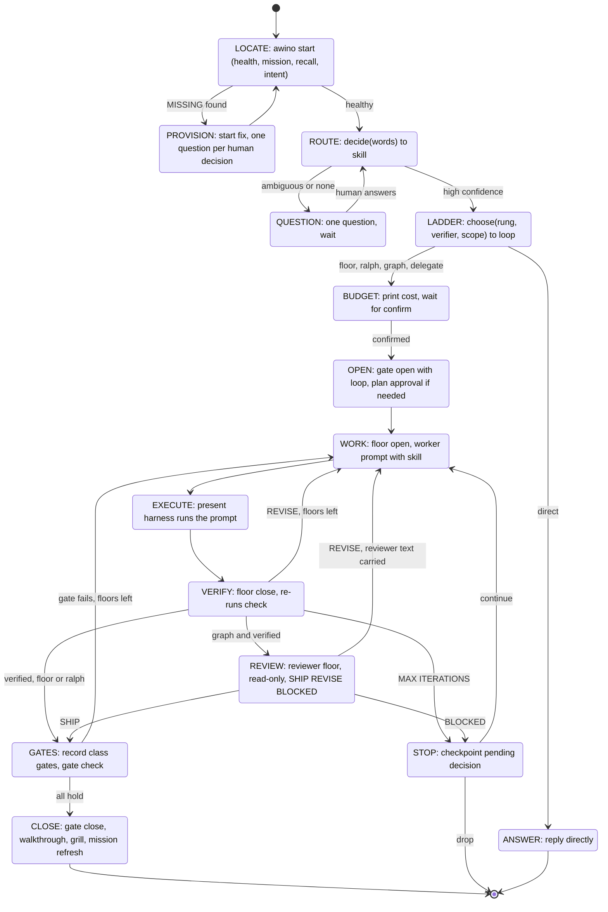

# One Operator: the ordered machine behind `awino best`

Status: **S1-S3 shipped and live-proven 2026-09-04** (Seed c8bf closed, independent review approved). **S5-S6 open** as Seed created this sitting. Diagram render-tested with mermaid-cli.

Grounding read for this plan (2/3 budget): `chapters/7-patterns/3-orchestrator-pattern.md`
(phase gating, spec file as shared context, context isolation via sub-agents) and
`chapters/6-harnesses/2-harness-stack.md` (the six harness components; "the diagnostic
audit sequence"). References examined: MCP `sequentialthinking` (revisable, branching
thought sequence with an explicit `nextThoughtNeeded` flag), Google ADK state-machine
agent (`current_step` in state; instruction says *"follow this state machine exactly, do
not skip steps"*), Microsoft Conductor (YAML workflow: steps, script steps route on exit
code, conditional routing, human gates, max-iterations, terminate steps).

## 0. First principles: why the harness is not working

**Fact.** Every capability exists and fires (exam 18/18). **Fact.** Nothing decides
which one to use. The human, or the persona from memory, picks a CLI command. That is
why the ladder is decorative, why the graph has one caller, why `playbook`, `loop`,
`graph`, `run_dispatch`, `session_state`, `project_template`, `watch` have **zero
core callers** (measured, table below) - each is a leaf someone must remember to touch.

Decomposed to the root: **A.W.I.N.O. has tools but no program counter.** ADK's answer is
a `current_step` in state that the instruction is *forbidden to skip*. Conductor's answer
is a YAML DAG with routing on exit codes. Sequential-thinking's answer is an explicit
sequence with `nextThoughtNeeded` and `branchFrom`. Ours has to be a **state machine
persisted in the ledger**, advanced by one command, where every transition names the
exact tool it calls. Not prose. Not a table the persona reads. A machine.

The simplest thing that works: **`awino best` becomes `awino step`** - it reads the
current node from the ledger, does exactly that node's one action, records the result,
picks the next node from a fixed edge table, and stops. Repeating it walks the graph.
Nothing is remembered; everything is read.

## 1. Measured dead ends (core callers = 0 means only the CLI, i.e. a human, reaches it)

| Module | Core callers | Verdict |
| --- | --- | --- |
| `graph.py` (worker+reviewer) | 1 (`exam`) | dead: transport needs headless `claude` login |
| `loop.py` (cmd retry) | 10 by name, **0 real** (matches the word "loop") | dead: `gate loop` only |
| `run_dispatch` (in-process loop) | 0 | dead: superseded by floors |
| `playbook.py` | 0 | leaf: only `best`/`gate close` call it |
| `session_state.py` | 0 | leaf: hook only |
| `project_template.py`, `watch.py` | 0 | leaves |
| rung-verdict artifact | **0 readers** | decorative |
| loop field on Run | **0 readers** | decorative |

Five executors, one human router, two decorative fields. That is the disease; a sixth
executor is not the cure.

## 2. The map - a graph that loops and goes back

Every node is one existing command. Every edge is a fixed rule on an observable value
(exit code, verdict string, floor count, confidence). There is no node whose action is
"decide what to do" - that is the whole point.

## 3. Who calls what, after

| Node | Calls (already exists) | Reads | Writes |
| --- | --- | --- | --- |
| LOCATE | `start` internals, `recall`, `playbook.load_intent` | ledger, lessons, intent | nothing |
| PROVISION | `provision.plan/apply` | fs | `.smith/`, `.venv` with consent |
| ROUTE | `dispatch.decide` | catalog | nothing |
| LADDER | **new** `ladder.choose` = `models.detect_rung` + `models` verifier strength + scope count | rung-verdict | `machine.json` node+loop |
| BUDGET | print | - | waits |
| OPEN | `Ledger.open(loop=)` | - | run |
| WORK | `dispatch.open_floor` (worker) | skill file | prompt, `dispatch-pending` |
| EXECUTE | the harness: this session's subagent, Claude Code, Cline, a human | prompt | scoped files |
| VERIFY | `dispatch.close_floor` | verify cmd | `dispatch-floor`, route |
| REVIEW | **new** `open_floor(role=reviewer)` + `close_floor` parsing verdict | worker's diff | `dispatch-review` |
| GATES | `gate record`, `gate check` (drift + weakening + scope) | diff | evidence |
| CLOSE | `gate close` -> `playbook.run_event("task-close")` | ledger | `WALKTHROUGH.md`, `MISSION.md`, intent cleared |
| STOP | `Ledger.checkpoint(pending_decision=)` | - | checkpoint |

The graph's value (independent reviewer) is REVIEW. Its dead transport is gone: the
reviewer is a read-only floor executed by whatever harness is present - exactly how
the worker runs. No login.

## 4. Blockers, each with the fix

| Blocker | Why it blocks | Fix (step) |
| --- | --- | --- |
| No program counter | nothing knows "where are we" between commands | `machine.json` in state root: `{node, loop, floor, run_id, updated}` (S1) |
| Ladder has no reader | choice is never made by code | `ladder.choose` returns `LoopChoice(loop, why)`; LADDER node writes it (S2) |
| Graph needs headless login | reviewer must be mechanically read-only | reviewer floor: `Role.REVIEWER` assignment, no scope, verdict parsed from a file the reviewer writes in the *ledger* dir (not project) (S3) |
| Five executors | human must choose | `run_dispatch`, `graph.py`, `loop.py`, `gate graph`, `gate loop` deleted; symbol-drift gate polices prose (S5) |
| Persona remembers the order | `PROSE_CANNOT_ENFORCE_PROSE` | persona says one thing: *run `awino step` until it says done or asks* (S6) |
| Compaction loses the node | fresh context forgets | `machine.json` is on disk; `RESUME` block (95fd) already re-injects; add node (S1) |
| Knowledge budget unused | consult never fetches | LOCATE node fetches the chapter the routed skill cites when a run opens; header `knowledge: n/3` counts it (S4) |

## 5. The one-shot plan

One `refactor` run per step; each step has a live proof in this session and a test.

| # | Step | Live proof | Test |
| --- | --- | --- | --- |
| **S1** | `machine.py`: `Node` enum from the diagram, `EDGES` table keyed on (node, observation), `load/save` in state root, `advance(observation)`. `awino step` reads node, runs its one action, records observation, advances, prints `NODE -> NEXT (why)`. `awino best "<words>"` = set node ROUTE with the words and call `step`. | `awino best "pytest is failing…"` → `step` × N walks LOCATE→ROUTE→LADDER→BUDGET and stops asking for budget | transition table is total: every (node, observation) has exactly one edge; no node self-loops without a counter |
| **S2** | `ladder.choose(request, skill, verify, scope)`: rung from `detect_rung`; verifier strength from `models`; → `direct` (prompt rung), `floor` (1 scope, strong verify), `ralph` (weak/flaky verify, retries expected), `graph` ("keeps", intermittent, or reviewer-class skill), `delegate` (≥3 disjoint scopes). Writes `loop` on the run. | `best` prints `LOOP graph (harness rung, weak verify: reviewer required)` | 6 fixtures → 6 loops, deterministic |
| **S3** | Reviewer floor: `open_floor(role="reviewer")` builds a `Role.REVIEWER` assignment (no scope, `context_paths`=worker's diff), verification = `verdict.json` in the ledger dir parses to SHIP/REVISE/BLOCKED. `close_floor` routes on it. REVIEW node wired. | worker floor → reviewer floor **in this session** → `SHIP`; second run: reviewer `REVISE` reopens WORK with reviewer text | 3 verdict paths + malformed verdict = BLOCKED |
| **S4** | LOCATE fetches the routed skill's cited chapter (≤1) via `knowledge.fetch`; header `knowledge:` = fetched count. | header reads `knowledge: 1/3` after a routed `best` | fetch is cache-first; budget never exceeds 3 |
| **S5** | Delete `run_dispatch`, `graph.py`, `loop.py`, `gate graph`, `gate loop`; fold cmd-only retry into `close_floor`. Exam probes for `graph.reachable`/`loop.reachable` replaced by `review.floor` and `machine.walk`. | exam 18/18 (renamed probes); `--help` shows no graph/loop | layout count drops; symbol drift clean |
| **S6** | Persona §Routing becomes: *"Run `awino step`. Repeat until it prints DONE or QUESTION. Never choose a tool yourself."* Quickstart: two commands (`best "<words>"`, `step`). | wiring test | persona contains no command table |

Stop points: after S1+S2 (you watch the machine walk and the ladder choose), after S3
(you watch a reviewer floor run here with no login).

## 6. Not adopted, and why

- **Conductor / ADK / pydantic-ai as runtime.** Each is a second orchestrator with its
  own state, its own provider config, its own YAML. We would then have our ledger *and*
  theirs. Their *ideas* are taken (current_step, routing on observations, human gates,
  max iterations); their runtimes are not. Revisit only if we need parallel fan-out
  beyond `delegate`.
- **MCP memory server.** The ledger + lessons + recall already are the memory; the gap
  was retrieval, fixed by `recall`. A graph store is a third memory to keep in sync.
- **Sequential-thinking as a tool.** Its shape (numbered, revisable steps with an
  explicit "next needed" flag) *is* S1's machine. Using the MCP server would put the
  program counter in a process we do not control.

## 7. Approval

- [ ] Approved. Start S1.

## 8. Execution log

| Step | Live proof | Found by proving, not by review |
| --- | --- | --- |
| S1 machine | `awino step "<words>"` walked LOCATE→PROVISION→LOCATE→ROUTE→LADDER→BUDGET(wait)→OPEN→WORK→EXECUTE→VERIFY→GATES in a fresh repo; `machine.json` history has every transition | GATES had to record the mechanical gates itself, not tell the human to; `tests_not_weakened` is `detect_test_weakening` over the diff, not "no diff under tests/" (a worker fixing a test is the normal case) |
| S2 ladder | `LOOP graph (second opinion required: intermittent symptom)`; `LOOP floor (harness rung, one scope, strong verify)`; six deterministic branches tested | `LOOPS` from 42d4 only allowed 4 names; the ladder's `floor`/`graph` refused at OPEN. Widened to 6 |
| S3 reviewer floor | VERIFY(graph)→REVIEW opened a `Role.REVIEWER` floor, verdict file under `state_root/reviews/`; this session wrote SHIP as a fresh context; `close_floor` parsed it → GATES. **No login anywhere.** | reviewer floor numbered `1` collided with the worker's closed floor `1` → "no pending floor". Fixed: `next_floor = closed_count + 1` |
| Payoff wiring | LOCATE prints `STANCE -> steel-man` on "I think we should…", `MISSION <objective> (n/8, k exams)`; LADDER flags work no exam mentions; CLOSE adjudicates, marks complete, fires walkthrough + grill + mission refresh + clear-intent - live, from the machine | First proof stopped at GATES and declared success while CLOSE only printed a suggestion. Lesson `PROOF_OF_SPINE_IS_NOT_PROOF_OF_PAYOFF` |
| Back and forth | QUESTION→(answer)→ROUTE; GATES(fail)→WORK; STOP→(continue)→WORK; STOP→(close)→GATES (added: human fixed the blocker out of band); STOP→(drop)→DONE - all live or tested | STOP needed a third answer, `close`, or a human who recorded a gate manually had no way back except a wasted floor |

Reviewer residuals fixed before close: dead code after `return` in `open_floor`; `_review` fell back to a tautological verify for the REVISE-opened worker floor (now discovers the real one or waits).